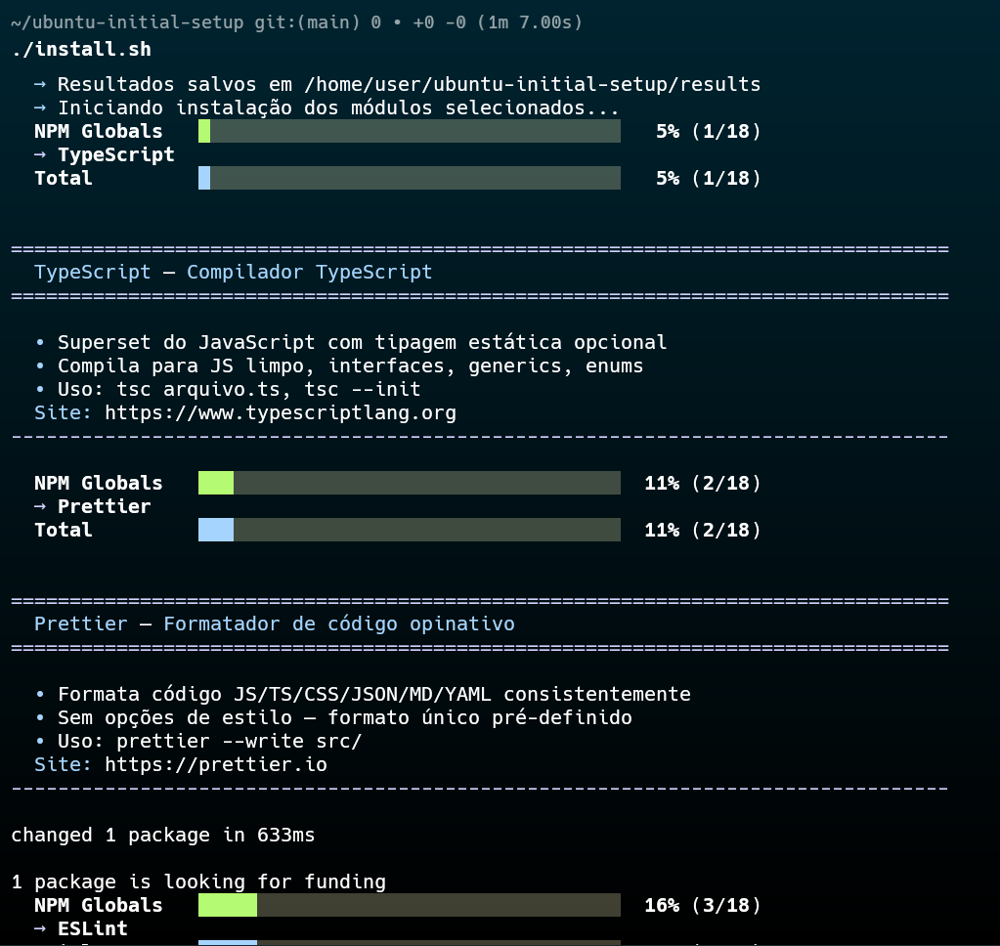
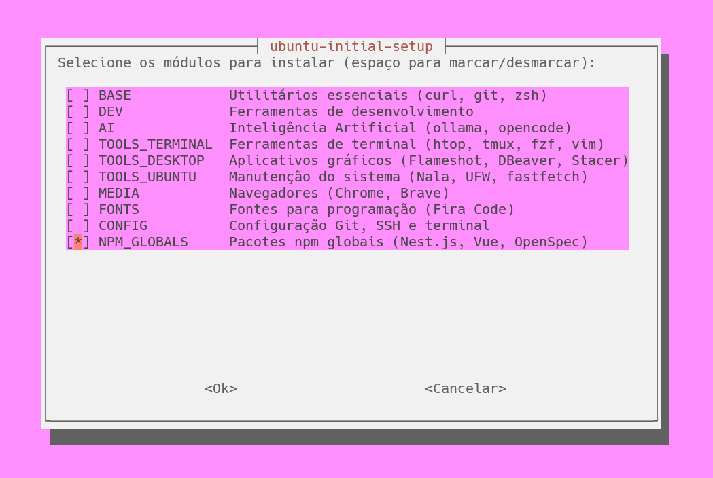
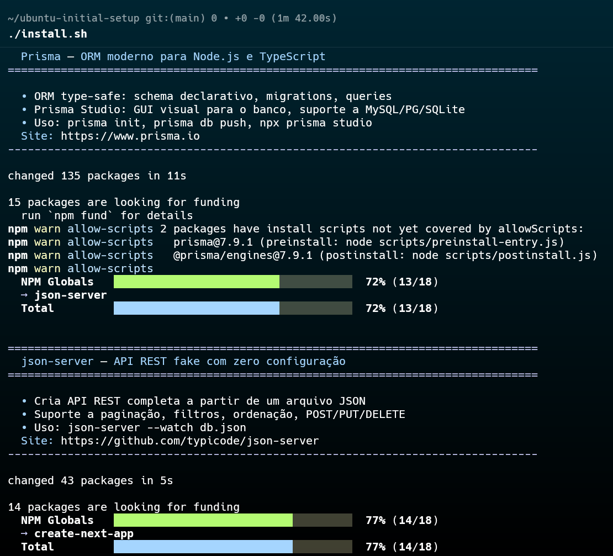

# Ubuntu Initial Setup

<p align="center">
  
  
  
</p>

<p align="center">
  
</p>

**Projeto pessoal** de scripts modulares para automatizar a instalação e configuração do Ubuntu — criado por e para desenvolvedores que precisam montar seu ambiente de trabalho rápido, seja do zero ou após um formato.

Ideal para usuários Ubuntu que:
- Formatam o computador com frequência e querem restaurar o setup em minutos
- Preferem escolher o que instalar via menu interativo
- Querem um ponto de partida para customizar seu próprio instalador

Fique à vontade para fazer um **fork**, remover o que não usa, adicionar seus programas favoritos e adaptar ao seu gosto.

## Sumário

- [Ubuntu Initial Setup](#ubuntu-initial-setup)
  - [Sumário](#sumário)
  - [Pré-requisitos](#pré-requisitos)
  - [Uso](#uso)
  - [Módulos](#módulos)
  - [Programas](#programas)
    - [Base](#base)
    - [Dev](#dev)
    - [AI](#ai)
    - [Tools Terminal](#tools-terminal)
    - [Tools Desktop](#tools-desktop)
    - [Tools Ubuntu](#tools-ubuntu)
    - [Media](#media)
    - [Fonts](#fonts)
    - [Config](#config)
    - [NPM Globals](#npm-globals)
  - [Flags](#flags)
  - [Relatórios](#relatórios)
  - [Progresso Visual](#progresso-visual)
  - [Testes](#testes)
  - [Estrutura](#estrutura)
  - [Arquitetura](#arquitetura)
  - [FAQ / Troubleshooting](#faq--troubleshooting)
    - [`curl: command not found`](#curl-command-not-found)
    - [Falha na instalação de algum pacote](#falha-na-instalação-de-algum-pacote)
    - [Algum programa não aparece no menu](#algum-programa-não-aparece-no-menu)
    - [Erro de permissão](#erro-de-permissão)
    - [Quero adicionar meus próprios programas](#quero-adicionar-meus-próprios-programas)
  - [Licença](#licença)


## Pré-requisitos

- **Ubuntu** ou distribuição baseada em Debian
- **Conexão com internet**
- **Espaço em disco**: variável conforme os módulos selecionados (~5 GB para instalação completa)
- **Privilégios sudo**: diversos módulos requerem permissão de superusuário

## Uso

A instalação pode ser feita de duas formas, com objetivos diferentes:

---

### `bootstrap.sh` — Instalação rápida (recomendado para primeira vez)

```bash
curl -fsSL https://raw.githubusercontent.com/angelorpt/ubuntu-initial-setup/main/bootstrap.sh | bash
```

**O que faz:**
1. Instala dependências mínimas (git, curl, wget, whiptail)
2. Clona (ou atualiza) o repositório em `~/ubuntu-initial-setup`
3. Executa `./install.sh --all` automaticamente (modo headless, sem perguntar)
4. Se executado interativamente (não via pipe), abre o menu whiptail

**Quando usar:** Você quer o ambiente completo rapidamente, sem clonar nada manualmente. Ideal para máquinas recém-formatadas. Basta colar o comando e aguardar.

**Comportamento via pipe vs terminal:**
- `curl ... | bash` → detecta pipe, executa `--all` automaticamente
- Rodar localmente com `bash bootstrap.sh` → abre o menu interativo do `install.sh`

---

### `install.sh` — Controle total sobre o que instalar

```bash
# 1. Clone manualmente
git clone https://github.com/angelorpt/ubuntu-initial-setup.git
cd ubuntu-initial-setup

# 2. Escolha o modo
./install.sh              # Menu interativo whiptail — você escolhe os módulos
./install.sh --all        # Instala tudo sem perguntar (do zero)
./install.sh --update     # Reinstala todos os programas (últimas versões)
./install.sh --retry      # Tenta novamente apenas os que falharam
./install.sh --continue   # Pula os que já deram certo, instala o resto
./install.sh --help       # Mostra ajuda
```

**O que faz:**
- **Sem argumentos:** abre um menu whiptail onde você escolhe entre instalação nova, continuar de onde parou, ou retentar falhas, seguido da seleção dos módulos desejados
- **`--all`:** execução headless — todos os módulos, do zero
- **`--update`:** igual ao `--all`, mas pensado para reinstalar/atualizar programas já existentes
- **`--retry`:** lê `results/failure.txt` da execução anterior e tenta apenas os programas que falharam
- **`--continue`:** lê `results/success.txt` e pula os já instalados, executando apenas os pendentes

**Quando usar:** Você quer controle granular — escolher exatamente quais módulos instalar, retentar falhas sem começar do zero, ou continuar uma instalação interrompida.

<p align="center">
  
</p>

---

### Comparação rápida

| | `bootstrap.sh` | `install.sh` |
|---|---|---|
| **Propósito** | Controle fino sobre instalação | One-liner para setup completo |
| **Clonagem** | Manual (`git clone`) | Automática |
| **Dependências** | Assume repositório já clonado | Instala git, curl, wget, whiptail automaticamente |
| **Menu interativo** | Sim, sem argumentos | Só se executado localmente (não via pipe) |
| **Headless** | `--all`, `--update` | Sim (via pipe) |
| **Retry/Continue** | `--retry`, `--continue` | Não |
| **Quando escolher** | Manutenção, reinstalação seletiva, depuração | Primeira instalação, máquina formatada |

## Módulos

| Módulo | Total | Programas |
|--------|-----------|-------|
| `base` | 4 | curl, git, gum, zsh + oh-my-zsh |
| `dev` | 22 | Python, Docker, NVM + Node LTS, Java (JDK), VSCode, Go, Postman, VirtualBox, Antigravity 2.0, Antigravity IDE, Terraform, GitHub CLI, AWS CLI, Ansible, build-essential, libssl-dev, kubectl, helm, minikube, Kiro CLI, ShellCheck, BATS |
| `ai` | 7 | Ollama, OpenCode, Serena, Hermes Agent, Antigravity CLI, Claude Code, GitHub Copilot CLI |
| `tools_terminal` | 14 | htop, tmux, ripgrep, fd, fzf, bat, eza, Starship, zoxide, nano, vim, Neovim, Anyquery, Superfile |
| `tools_desktop` | 12 | Flameshot, Espanso, HyperKeys, IMWheel, GParted, Wave Terminal, Warp Terminal, Draw.io, DBeaver, Stacer, BleachBit, Timeshift |
| `tools_ubuntu` | 8 | Nala, fastfetch, ncdu, duf, deborphan, lm-sensors, UFW, Unattended Upgrades |
| `media` | 2 | Google Chrome, Brave |
| `fonts` | 6 | Fira Code, JetBrains Mono, Cascadia Code, IBM Plex, Victor Mono, Monaspace |
| `config` | 3 | Git config, SSH key, Gogh terminal themes |
| `npm-globals` | 18 | TypeScript, Prettier, ESLint, pnpm, Yarn, tsx, Nodemon, Concurrently, Serve, Nest.js, Vue.js, Prisma, json-server, create-next-app, npm-check-updates, live-server, 9Router, OpenSpec |

## Programas

### Base

| Programa | Descrição | Site |
|----------|-----------|------|
| Curl | Ferramenta de transferência de dados via URL | https://curl.se |
| Git | Sistema de controle de versão distribuído | https://git-scm.com |
| Gum | Ferramenta de UI para shell scripts | https://github.com/charmbracelet/gum |
| Zsh + Oh My Zsh | Terminal aprimorado com plugins e temas | https://ohmyz.sh |

### Dev

| Programa | Descrição | Site |
|----------|-----------|------|
| build-essential | Meta-pacote com gcc, g++, make e ferramentas de compilação | https://packages.ubuntu.com/build-essential |
| libssl-dev | Headers do OpenSSL para compilação de pacotes | https://packages.ubuntu.com/libssl-dev |
| Python | Linguagem de programação versátil | https://www.python.org |
| Docker | Plataforma de contêineres para desenvolvimento e deployment | https://docs.docker.com/engine/install/ubuntu |
| NVM + Node | Gerenciador de versões do Node.js + Node LTS | https://github.com/nvm-sh/nvm |
| Java (JDK) | Kit de desenvolvimento Java padrão (OpenJDK) | https://openjdk.org |
| VSCode | Editor de código da Microsoft com extensões | https://code.visualstudio.com |
| Go | Linguagem de programação compilada do Google | https://snapcraft.io/go |
| Postman | Plataforma de API para desenvolvimento | https://snapcraft.io/postman |
| VirtualBox | Hipervisor de código aberto para virtualização | https://www.virtualbox.org |
| Antigravity 2.0 | Plataforma de desenvolvimento agente-first do Google | https://antigravity.google |
| Antigravity IDE | IDE para desenvolvimento agente-first | https://antigravity.google |
| Terraform | Infraestrutura como código pela HashiCorp | https://developer.hashicorp.com/terraform/install#linux |
| GitHub CLI | CLI oficial do GitHub | https://cli.github.com |
| AWS CLI | CLI oficial da Amazon Web Services | https://aws.amazon.com/cli |
| Ansible | Automação de infraestrutura | https://www.ansible.com |
| kubectl | CLI oficial do Kubernetes | https://kubernetes.io |
| Helm | Gerenciador de pacotes Kubernetes | https://helm.sh |
| Minikube | Kubernetes single-node local para estudos | https://minikube.sigs.k8s.io |
| Kiro CLI | CLI da plataforma Kiro | https://kiro.dev/cli |
| ShellCheck | Análise estática para scripts shell | https://www.shellcheck.net |
| BATS | Testes automatizados para Bash | https://bats-core.readthedocs.io |

### AI

| Programa | Descrição | Site |
|----------|-----------|------|
| Ollama | Plataforma local para execução de modelos de linguagem | https://ollama.com |
| OpenCode | Assistente de engenharia de software no terminal | https://opencode.ai |
| Serena | MCP toolkit semântico para agentes de código | https://github.com/oraios/serena |
| Antigravity CLI | CLI para desenvolvimento agente-first do Google | https://antigravity.google |
| Claude Code | Assistente de codificação IA da Anthropic | https://code.claude.com |
| GitHub Copilot CLI | Assistente de linha de comando com IA do GitHub | https://github.com/features/copilot/cli |

### Tools Terminal

| Programa | Descrição | Site |
|----------|-----------|------|
| htop | Monitor de processos interativo | https://htop.dev |
| tmux | Multiplexador de terminal com sessões persistentes | https://github.com/tmux/tmux |
| ripgrep | Ferramenta de busca turbo em Rust | https://github.com/BurntSushi/ripgrep |
| fd | Alternativa moderna ao find | https://github.com/sharkdp/fd |
| fzf | Buscador fuzzy generalizado para terminal | https://github.com/junegunn/fzf |
| bat | cat com syntax highlight | https://github.com/sharkdp/bat |
| eza | ls moderno com ícones e git status | https://github.com/eza-community/eza |
| Starship | Prompt minimalista e personalizável | https://starship.rs |
| zoxide | cd inteligente que aprende seus diretórios | https://github.com/ajeetdsouza/zoxide |
| Nano | Editor de texto simples para terminal | https://www.nano-editor.org |
| Vim | Editor de texto clássico e poderoso | https://www.vim.org |
| Neovim | Fork moderno do Vim com suporte a Lua | https://neovim.io |
| Anyquery | Ferramenta de consulta SQL para qualquer fonte de dados | https://anyquery.dev |
| Superfile | Gerenciador de arquivos no terminal | https://superfile.dev |

### Tools Desktop

| Programa | Descrição | Site |
|----------|-----------|------|
| Flameshot | Ferramenta de captura de tela com anotações | https://flameshot.org |
| Espanso | Expansor de texto para produtividade | https://espanso.org |
| HyperKeys | Atalhos de teclado personalizados | https://hyperkeys.xureilab.com |
| IMWheel | Ajuste de velocidade do scroll do mouse | https://imwheel.sourceforge.net |
| GParted | Gerenciador de partições de disco | https://gparted.org |
| Wave Terminal | Terminal moderno com widgets integrados | https://www.waveterm.dev |
| Warp Terminal | Terminal moderno com IA integrada | https://www.warp.dev |
| Draw.io | Editor de diagramas e fluxogramas | https://www.drawio.com |
| DBeaver | Gerenciador de bancos de dados universal | https://dbeaver.io |
| Stacer | Otimizador e monitor do sistema | https://github.com/oguzhaninan/Stacer |
| BleachBit | Limpeza de cache e lixo do sistema | https://www.bleachbit.org |
| Timeshift | Backup incremental do sistema com snapshots | https://github.com/linuxmint/timeshift |

### Tools Ubuntu

| Programa | Descrição | Site |
|----------|-----------|------|
| Nala | Frontend moderno para o apt | https://gitlab.com/volian/nala |
| fastfetch | Informações do sistema rápidas e bonitas | https://github.com/fastfetch-cli/fastfetch |
| ncdu | Análise de uso de disco em TUI | https://dev.yorhel.nl/ncdu |
| duf | df moderno com gráficos e cores | https://github.com/muesli/duf |
| deborphan | Localiza pacotes órfãos no sistema | https://packages.debian.org/deborphan |
| lm-sensors | Monitoramento de temperatura da CPU/GPU | https://github.com/lm-sensors/lm-sensors |
| UFW | Firewall simples para Ubuntu | https://help.ubuntu.com/community/UFW |
| Unattended Upgrades | Atualizações automáticas de segurança | https://wiki.debian.org/UnattendedUpgrades |

### Media

| Programa | Descrição | Site |
|----------|-----------|------|
| Google Chrome | Navegador web do Google | https://www.google.com/chrome |
| Brave | Navegador focado em privacidade | https://brave.com |

### Fonts

| Programa | Descrição | Site |
|----------|-----------|------|
| Fira Code | Fonte monoespaçada com ligaduras para programação | https://github.com/tonsky/FiraCode |
| JetBrains Mono | Fonte para programação desenhada pela JetBrains | https://www.jetbrains.com/lp/mono |
| Cascadia Code | Fonte monoespaçada da Microsoft com ligaduras | https://github.com/microsoft/cascadia-code |
| IBM Plex | Família de fontes da IBM com design elegante | https://www.ibm.com/plex |
| Victor Mono | Fonte com itálico cursivo e ligaduras | https://rubjo.github.io/victor-mono |
| Monaspace | Família de fontes do GitHub com 5 variantes | https://monaspace.githubnext.com |

### Config

| Programa | Descrição | Site |
|----------|-----------|------|
| Git Config | Identificação para commits Git | — |
| SSH Key | Chave SSH para autenticação em serviços remotos | — |
| Gogh Terminal | Temas para o terminal GNOME | https://github.com/Gogh-Co/Gogh |

### NPM Globals

| Programa | Descrição | Site |
|----------|-----------|------|
| TypeScript | Compilador TypeScript | https://www.typescriptlang.org |
| Prettier | Formatador de código opinativo | https://prettier.io |
| ESLint | Linter de JavaScript/TypeScript | https://eslint.org |
| pnpm | Gerenciador de pacotes rápido e eficiente | https://pnpm.io |
| Yarn | Gerenciador de pacotes alternativo | https://yarnpkg.com |
| tsx | Executar TypeScript diretamente sem compilar | https://github.com/privatenumber/tsx |
| Nodemon | Auto-restart em alterações de código | https://nodemon.io |
| Concurrently | Rodar múltiplos comandos em paralelo | https://github.com/open-cli-tools/concurrently |
| Serve | Servidor estático moderno pela Vercel | https://github.com/vercel/serve |
| Nest.js | Framework Node.js progressivo | https://nestjs.com |
| Vue.js | Framework JS progressivo | https://vuejs.org |
| Prisma | ORM moderno para Node.js e TypeScript | https://www.prisma.io |
| json-server | API REST fake com zero configuração | https://github.com/typicode/json-server |
| create-next-app | Scaffolding de projetos Next.js | https://nextjs.org |
| npm-check-updates | Atualizar versões de dependências no package.json | https://github.com/raineorshine/npm-check-updates |
| live-server | Servidor com live reload para páginas estáticas | https://github.com/tapio/live-server |
| 9Router | Roteador CLI | https://github.com/decolua/9router |
| OpenSpec | Gerenciador de mudanças para projetos de IA | https://github.com/Fission-AI/OpenSpec |

## Flags

| Flag / Modo | Script | Comando | O que faz | Quando usar |
|---|---|---|---|---|
| *(nenhuma)* | `install.sh` | `./install.sh` ou `bash bootstrap.sh` (terminal) | Menu whiptail: escolhe entre new/continue/retry, depois seleciona os módulos | Você quer escolher o que instalar, ou decidir entre fresh/continue/retry no momento |
| `--all` | `install.sh` | `./install.sh --all` | Instala **todos** os módulos em modo headless. Limpa o histórico (`init_results --fresh`). | Máquina recém-formatada, você quer tudo do zero sem interagir |
| `--update` | `install.sh` | `./install.sh --update` | Reinstala **todos** os programas (últimas versões). Também limpa o histórico. | Você já tem o setup instalado mas quer atualizar tudo para a versão mais recente |
| `--retry` | `install.sh` | `./install.sh --retry` | Lê `results/failure.txt` da execução anterior e tenta **apenas** os programas que falharam. Pula os já instalados com sucesso. | Alguns programas falharam (rede instável, repositório offline) e você quer tentar de novo sem refazer tudo |
| `--continue` | `install.sh` | `./install.sh --continue` | Lê `results/success.txt` e pula os já instalados. Executa **apenas** os programas que ainda não constam como sucesso. | A instalação foi interrompida no meio e você quer continuar de onde parou sem repetir os já instalados |
| `--help` | `install.sh` | `./install.sh --help` | Exibe a ajuda com todas as opções disponíveis | Você esqueceu as opções ou está conhecendo o projeto |
| via pipe | `bootstrap.sh` | `curl ... | bash` | Detecta pipe, clona o repositório e executa `install.sh --all` automaticamente. | Setup completo em um comando, sem clonar nada manualmente |

## Relatórios

Cada execução gera `results/` no diretório clonado:

```
results/
├── success.txt     — programs installed successfully
├── failure.txt     — programs that failed
└── report.txt      — formatted report with summary by category
```

Se houver falhas, `./install.sh --retry` lê `failure.txt` e tenta novamente apenas os programas pendentes — útil para falhas temporárias (rede, repositório instável).

## Progresso Visual

Durante a instalação, duas barras de progresso são exibidas em tempo real:

```
  Dev          ████████████████████░░░░░░  75% (3/4)
  → Docker
  Total        ████████████████░░░░░░░░░░  25% (3/12)
```

- **Linha 1**: progresso do módulo atual com nome, barra, percentual e contagem
- **Linha 2**: nome do programa sendo instalado no momento
- **Linha 3**: progresso global (total de todos os módulos)

O sistema detecta automaticamente o **gum** (instalado via `base.sh`), mas funciona sem ele com cores ANSI puras.

<p align="center">
  
</p>

## Testes

O projeto possui testes com duas ferramentas:

| Ferramenta | Alvo | O que testa |
|---|---|---|
| **ShellCheck** | Todos os `.sh` em `./`, `lib/` e `install/` | Análise estática — detecta erros de sintaxe, variáveis não utilizadas, problemas de quoting e más práticas em shell script |
| **BATS** (Bash Automated Testing System) | `tests/lib/*.bats` | Testes de unidade — verifica o comportamento isolado das funções das bibliotecas |

**Testes disponíveis (BATS):**

| Arquivo | O que cobre |
|---|---|
| `tests/lib/log.bats` | `print_header`, `print_details`, `log_info`, `log_success`, `log_error` |
| `tests/lib/progress.bats` | `init_progress`, `update_progress`, barras de progresso |
| `tests/lib/results.bats` | `init_results`, `track`, registro de sucesso/falha |
| `tests/lib/utils.bats` | `die_on_error`, `ensure_whiptail`, `ensure_snap`, `ensure_flatpak` |

**Pré-requisitos:**

```bash
sudo apt install shellcheck bats
```

**Como executar:**

```bash
# ShellCheck + BATS (completo)
bash tests/run.sh

# Apenas ShellCheck
bash tests/lint.sh

# Apenas BATS
bats tests/lib/
```

## Estrutura

```
ubuntu-initial-setup/
├── bootstrap.sh          # curl | bash — instala dependências e executa install.sh
├── install.sh            # Ponto de entrada com menu interativo e CLI flags
├── install/
│   ├── base.sh             # curl, git, gum, zsh
│   ├── dev.sh              # Python, Docker, NVM, Java, VSCode, Go, kubectl, helm e mais
│   ├── ai.sh               # Ollama, OpenCode, Serena, Hermes, Antigravity CLI, Claude Code, GitHub Copilot CLI
│   ├── tools_terminal.sh   # htop, tmux, ripgrep, fzf, vim, Neovim, Superfile
│   ├── tools_desktop.sh    # Flameshot, Espanso, Draw.io, DBeaver, Stacer, Timeshift
│   ├── tools_ubuntu.sh     # Nala, fastfetch, ncdu, duf, UFW
│   ├── media.sh            # Chrome, Brave
│   ├── fonts.sh            # Fira Code, JetBrains Mono, Cascadia Code, Victor Mono, Monaspace
│   ├── config.sh           # Git, SSH, Gogh
│   └── npm-globals.sh      # TypeScript, Nest.js, Vue.js, Prisma e mais
├── lib/
│   ├── colors.sh         # Cores ANSI
│   ├── log.sh            # log_info, log_success, log_error, print_header
│   ├── utils.sh          # Utilitários (die_on_error, download_to_temp, install_deb, ensure_snap, ensure_flatpak)
│   ├── progress.sh       # Barras de progresso (módulo + total)
│   └── results.sh        # Tracking de resultados, relatório e retry
└── tests/
    ├── run.sh              # Runner: lint + BATS
    ├── lint.sh             # ShellCheck em todos os .sh
    ├── helpers.bash        # source_lib() para BATS
    └── lib/
        ├── log.bats        # Testes: print_header, print_details, log_*
        ├── progress.bats   # Testes: init_progress, update_progress
        ├── results.bats    # Testes: init_results, track
        └── utils.bats      # Testes: die_on_error, ensure_whiptail, ensure_snap, ensure_flatpak
```

## Arquitetura

- **Strict mode** (`set -uo pipefail`) em `install.sh` — sem `set -e` para não abortar em caso de erro em um módulo
- **Versões dinâmicas**: resolvidas via GitHub API (`releases/latest`) ou scraping da página oficial — sem versões fixas
- **Cada função de instalação** segue o padrão `# <url>` + `print_header` + `log_info "↪ <url>"` + comandos + `log_success`
- **Tracking independente**: `results.sh` registra em arquivo separadamente da saída do terminal
- **Snap/Flatpak**: funções que usam `snap install` ou `flatpak install` chamam `ensure_snap()` / `ensure_flatpak()` antes para garantir que o gerenciador esteja instalado

## FAQ / Troubleshooting

### `curl: command not found`
O bootstrap.sh instala curl automaticamente. Se for executar manualmente, instale antes com `sudo apt install curl -y`.

### Falha na instalação de algum pacote
Pode ser rede instável, repositório temporariamente fora do ar ou pacote já instalado. Execute `./install.sh --retry` para tentar novamente apenas os programas que falharam.

### Algum programa não aparece no menu
Verifique se o módulo correspondente existe em `install/`. O menu whiptail lista automaticamente os módulos encontrados.

### Erro de permissão
Certifique-se de que seu usuário tem permissão sudo. Alguns módulos instalam pacotes via `apt`, `snap` ou scripts que exigem superusuário.

### Quero adicionar meus próprios programas
Faça um fork do projeto, veja o template guiado em `install/_template.sh` com exemplos práticos para adicionar programas ou criar módulos novos.

## Licença

[MIT](LICENSE) — use, modifique e compartilhe à vontade.
